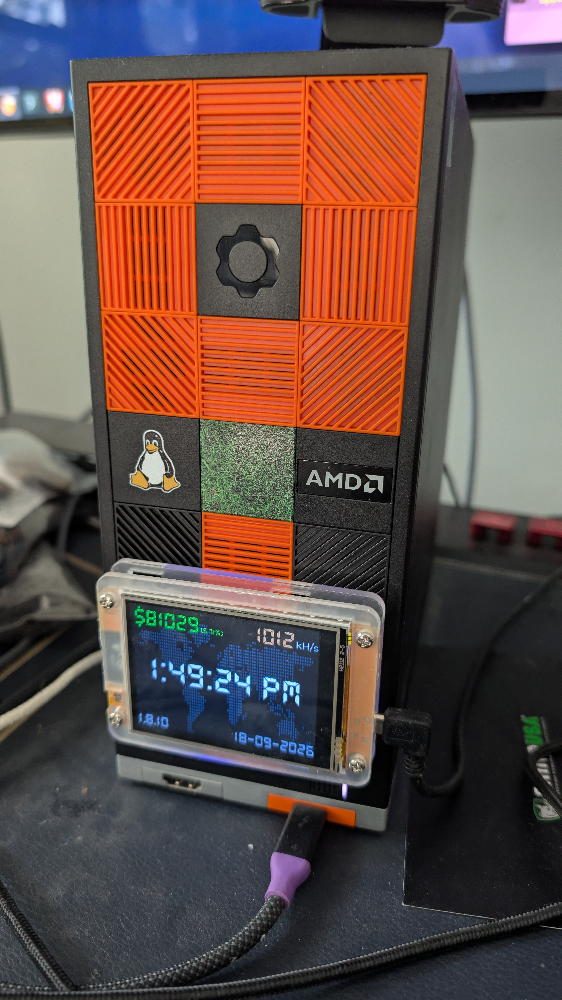
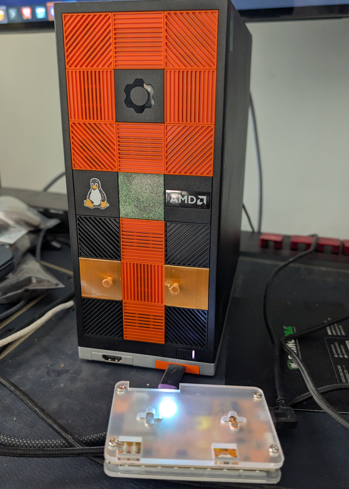

# Desktop Tiles

OpenSCAD models for Framework Desktop front-panel tiles, including a tile with a headed peg for mounting the small miner display shown below.

The installed setup uses two mounting tiles, with a vented tile between them. The second photo shows the exposed pegs and the mounting slots on the back of the display case.

<p>
  
  
</p>

## Files

| File | Purpose |
| --- | --- |
| [desktoptile-minermount.scad](desktoptile-minermount.scad) | Miner mounting tile; includes the base tile and adds a headed cylindrical peg. |
| [tile_base.scad](tile_base.scad) | Reusable tile geometry, retention hooks, and solid or vented tile variants. |
| [desktop-tile-miner-mount.stl](desktop-tile-miner-mount.stl) | Included mesh for slicing and printing. |

## Open and export

1. Keep both `.scad` files in the same directory.
2. Open `desktoptile-minermount.scad` in OpenSCAD.
3. Preview with **F5**, then render with **F6**.
4. Export the rendered model as STL and open it in your slicer.

With the OpenSCAD command-line tool installed, export from the project directory:

```sh
openscad -o miner-mount.stl desktoptile-minermount.scad
```

Alternatively, open the included STL directly in your slicer. Printer settings and material are not specified in this repository.

## Miner mounting tile

`desktoptile-minermount.scad` includes `tile_base.scad` and sets `tile_type = "blank"`. This causes the included file to generate a solid tile with its frame and retention features. The main file also unions `full_frame()` with its custom `mount()` module; the repeated frame overlaps the frame already generated by the include.

All dimensions below are in millimeters.

| Feature | Value | Source |
| --- | --- | --- |
| Nominal tile width and height | 28.5 × 28.5 | `tile_size` in `tile_base.scad` |
| Front and frame thickness | 2.3 | `front_thickness`, `frame_thickness` |
| Peg position | X = 6.5, Y = 0, Z = −5.5 | `translate([6.5, 0, -5.5])` |
| Peg shaft | Diameter 3.5, height 7.8 | `cylinder(7.8, 1.75, 1.75)` |
| Peg head | Diameter 6, thickness 1 | `cylinder(1, 3, 3)` |
| Cylinder segments | 70 | `$fn = 70` |

The shaft runs from Z = −5.5 to Z = 2.3, joining the tile face. Its wider head sits at the outward end, from Z = −5.5 to Z = −4.5. Tile retention features extend in the positive Z direction.

To adapt the mount, edit the translation for peg placement and the cylinder heights/radii for the shaft and head. Check these dimensions against your display case's mounting slots before printing. The pictured arrangement uses two copies of the mounting tile.

The main file sets `$colorize_parts = false`, but the base file actually reads `$colorize_elements`. To disable the base's preview colors, use `$colorize_elements = false`; colors do not affect exported geometry.

## Base tile

Open `tile_base.scad` on its own to preview the available designs. Set `tile_type` to:

| Value | Output |
| --- | --- |
| `"all"` | Default: frame, blank, diagonal slats, and horizontal slats in a 2 × 2 layout. |
| `"blank"` | Solid tile. |
| `"horizontal"` | Tile with horizontal slats. |
| `"cross"` | Tile with angled slats, controlled by `hatch_angle`. |
| `"frame"` | Frame and retention features without a center fill. |
| `"mounts"` | Retention features only. The Customizer annotation says `"mounts (debug)"`, but the code checks for `"mounts"`. |

General controls include `tolerance = 0.4`, `hatch_angle = 45`, and `hatch_thickness = 1.125`. Tolerance affects selected fit and cutout geometry; it does not uniformly shrink the entire tile. The specification section defines the frame, raised edges, constraints, and hooks and is marked to avoid changing.

For a custom design, suppress the base file's automatic output with `tile_type = "none"` and call its modules explicitly:

```scad
include <tile_base.scad>
tile_type = "none";
$colorize_elements = false;

union() {
    blank_tile();
    // Add your geometry here.
}
```

Useful modules include `blank_tile()` for a complete solid tile, `full_frame()` for a frame with retention features, and `mounts()` for just the retention geometry. `solid_fill()`, `horizontal_fill()`, and `crosshatch_fill()` provide center fills.

## Attribution

The header of `tile_base.scad` credits **Marcin Raczkowski (Marmot.Tech), copyright 2025**, and identifies its license as **CC BY-SA 4.0**. See the source header for the license URL and the referenced Framework Desktop blank-tile specification.
